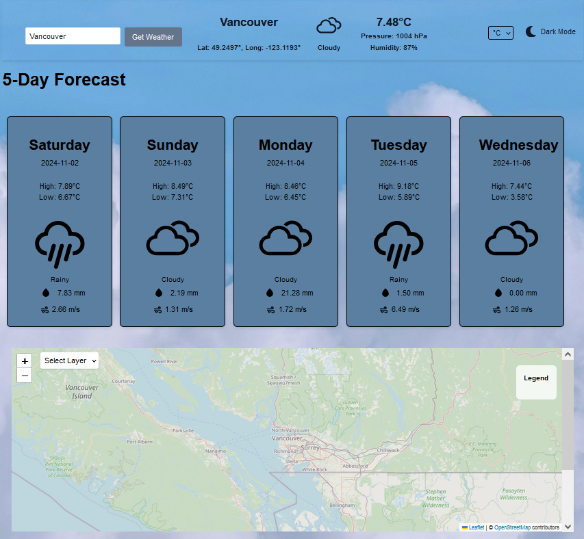
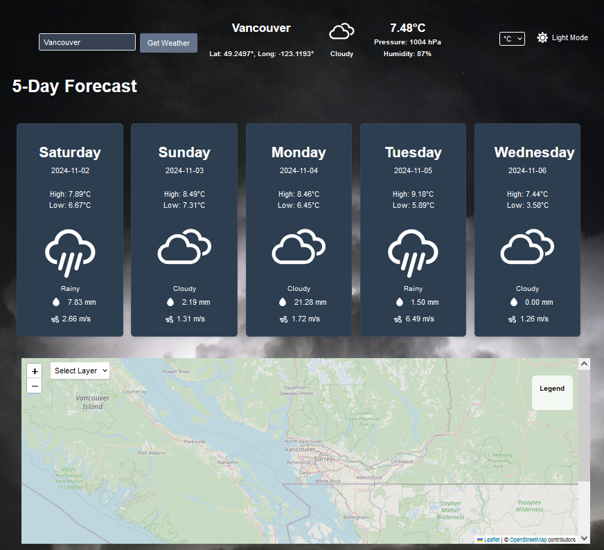
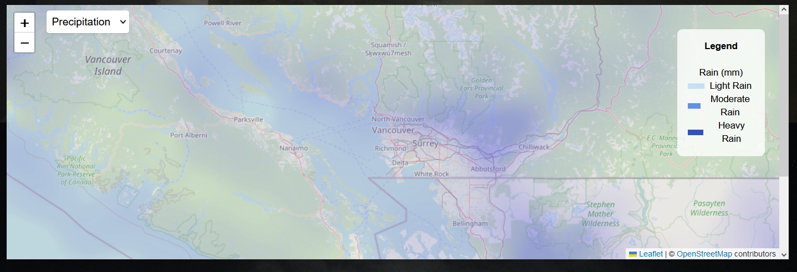

# Weather Web Application
==========================
### Overview
---------------
This weather web application provides real-time weather metrics using the OpenWeatherMap API. The use of a React framework for this projet configured with Vite, and Tailwind CSS allowed for a fast development environment. 

The intuitive, visually engaging weather data idsplayed dynamically through metrics such as temperature, humidity, precipitation and wind speed serve as a functional, reliable application.


### Features
---------------
Key Features of this application include

- Real-Time updates using OpenWeatherMap API
- Search Bar for dynamic location input
- Unit Selection Between Farenheight and Celcius
- Toggle Selection between DarkMode and Lightmode
- Current Forecast
- Five-Day Forecast
- Location Map with Weather Metrics 
    - Temperature
    - Humidity
    - Precipitation
    - Wind Speed


### User Interface
---------------
#### Main Screen
Light Mode (Default)


Dark Mode


Interactive map

### Structure
---------------
```
/Weather_App_React
│
├── /public
│
├── /src
│   ├── /assets
│   │   ├── pexels-d-ng-nhan-324384-1529881.jpg
│   │   └── pexels-couleur-29008111.jpg
│   │
│   ├── /components
│   │   ├── DailyForecast.jsx
│   │   ├── ForecastCard.jsx
│   │   ├── Legend.jsx
│   │   ├── MapComponent.jsx
│   │   ├── Nav.jsx
│   │   └── WeatherIcon.jsx
│   │
│   ├── /hooks
│   │   └── useWeather.jsx
│   │
│   ├── /utils
│   │   └── groupByDay.jsx
│   │
│   ├── App.jsx
│   ├── main.jsx
│   ├── index.css
│   └── vite.config.js (or other configuration files)
├── .env
├── tailwind.config.js
├── index.html
└── package.json
```
#### Explanation of the Structure:
- /src: The main source folder for the application.

- /assets: Contains images for use in the application.

- /components: Contains all the React components used in the application.
    - Nav.jsx: The navigation bar component that allows users to search for a city and toggle between dark and light modes.
        - Displays a search input for entering the city name and a button to fetch the weather.
        - Shows the current weather conditions, including temperature, humidity, and pressure.
        - Provides a dropdown to select metric units (Celsius or Fahrenheit) and a button to toggle the theme.

    -  DailyForecast.jsx: Displays the daily weather forecast for the next five days.
        - Accepts daily weather data and metric units as props.
        - Groups and formats the forecast data, calculating high and low temperatures, total precipitation, and wind speed.
        - Renders a ForecastCard for each day's forecast.

    - ForecastCard.jsx: Represents an individual day's weather forecast in a card format.
        - Displays the day of the week, date, high and low temperatures, total precipitation, total snowfall, and wind speed.
        - Uses the WeatherIcon component to visually represent the weather condition.

    - Legend.jsx: Provides a legend for the different weather layers displayed on the map.
        - Displays information based on the selected layer (e.g., precipitation, clouds, temperature, wind speed).
        - Helps users understand the color coding and data represented on the map.

    - MapComponent.jsx: Displays the interactive weather map using the react-leaflet library.
        - Renders the map and allows users to select different weather layers to visualize (e.g., precipitation, clouds).
        - Contains a dropdown to select the layer and uses RecenterMap to adjust the map view based on the selected city’s coordinates.

    - WeatherIcon.jsx: Displays an icon representing the current weather condition.
        - Accepts a weather condition string and renders an appropriate icon based on the condition (e.g., sunny, rainy, snowy).
        - Provides a visual cue to enhance the user experience.
        
- /hooks: Contains custom hooks
    - useWeather.jsx: A custom hook to encapsulate the logic for fetching weather data from the OpenWeatherMap API.
        - Manages state for weather data, forecast data, loading status, and errors.
        - Defines a function to fetch weather and forecast data based on the city name and selected units.

- /utils: Contains utility functions
    - groupByDay.jsx: A utility function to organize forecast data by day.
        - Groups the forecast entries based on the date, making it easier to display a daily forecast.

- /styles: Contains CSS files for styling the application.

- App.jsx: The main component that serves as the entry point for the application. It manages the overall state and layout of the app.
    - Initializes state variables for city name, metric units, dark mode, and weather data.
    - Uses the custom hook useWeather to fetch weather data and forecasts.
    - Renders the navigation bar, daily forecast, and map components.
    - Handles theme toggling and unit selection.


### External Libraries and Frameworks
---------------
- axios: HTTP client for requests to external APIs.
- react: A JS Framework for building interfaces, particularly single-page applications.
- react-dom: DOM-specific enabling the rendering of React components to the DOM.
- react-icons: A library that provides popular icons as React components.
- react-leaflet: A React wrapper for Leaflet, for interactive maps to integrate maps into React.
- react-router-dom: A library for routing in React applications, enabling navigation between different components and views.
- tailwindcss: A utility-first CSS framework for creating custom designs directly in your markup.

### Setup
---------------
To run the application, follow these steps:
1. Clone the repository using
 ``` 
 git clone https://github.com/VickyHowe/Weather_App_React.git 
 ```
 2.  Install the required packages by running npm install in the project directory
```
npm install
```
3. Create `.env` file in the main project folder.
    - Create an OpenWeatherMapAPI at https://openweathermap.org/api instructions can be found [here](https://www.educative.io/answers/how-to-get-the-openweather-api-key). **Note**Settingup a new key takes time and OpenWeather will inform you when it is ready.

4. Add your OpenWeatherMap API key to the `.env` file and replace `YOURKEYHERE` with your OpenWeather API Key.

`.env`
```
VITE_WEATHER_API_KEY=YOURKEYHERE
```
### Running the Program
To run the application, execute the following command in terminal for the project directory:
```
npm run dev
```
This will start the development server and make the application accessible at http://localhost:5173/

### References
---------------
- Throughout this project I referenced Blackbox ai to aid in troubleshoot issues when I got stuck.

1) Chat blackbox: Ai code generation, code chat, code search. Chat Blackbox: AI Code Generation, Code Chat, Code Search. (n.d.). https://www.blackbox.ai/ 

- API
2) How to get the OpenWeather Api Key. Educative. (n.d.). https://www.educative.io/answers/how-to-get-the-openweather-api-key 

3) Andy. (n.d.). Weather API Project Tutorial using HTML, CSS, and JavaScript | For Beginners. YouTube. https://youtu.be/JubKY5p3qRc 


- Styling

4) Coderflix. (n.d.). Responsive Tailwind CSS Navbar || React || Vite. YouTube. https://www.youtube.com/watch?v=siIZfsZxSIs 

- Images

5) Free stock photos, royalty free stock images & Copyright Free Pictures · Pexels. (n.d.-a). https://www.pexels.com/ 

- Map
6) React leaflet. React Leaflet. (n.d.). https://react-leaflet.js.org/ 
https://openweathermap.org/api/weathermaps
7) Weather maps 1.0 - OpenWeatherMap. (n.d.-c). https://openweathermap.org/api/weathermaps 


### Summary
---------------
This project was a challenge to create a weather application that fetches data from the OpenWeatherMap API.

#### Things I learned
- Creating API keys and integrating them with React
- Using Tailwind CSS in-line
- Using React Leaflet to display a map


#### Things I found difficult

- API key in .env specifically requiring VITE in name
- The useeffect update for toggling units from F to C and city
- passing data correctly to calculate daily averages
- styling the map and legend components

#### Nice To Have Future Features

- Implementing a more interactive and user-friendly interface
- Adding more weather metrics and features
- Improving the application's performance and optimization
- Integrating the application with other APIs for more featuresenge to create a weather application that fetches data from the OpenWeatherMap API.

